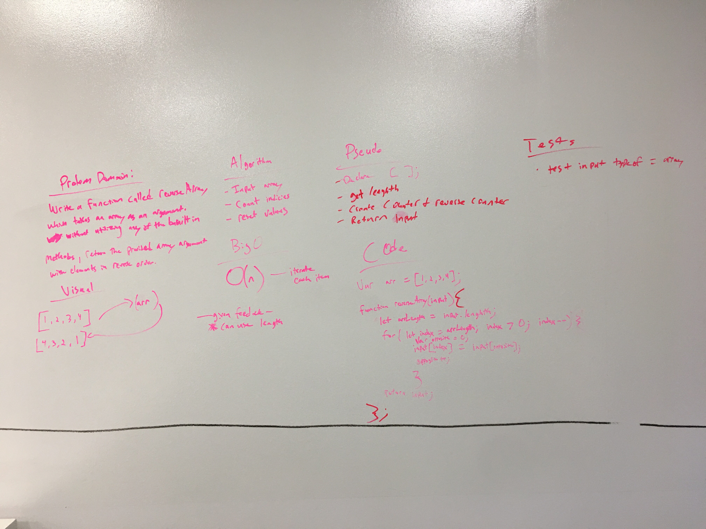

 coding-challenge-01: array_reverse
===
# Summary
array_reverse.js is a clean and reusable function for reversing an array.

### Prerequisites

Define an array and input it into this function. The values can be any length and any type so long as the variable is an array with legal array elements.

```
var myTestArr = [ "a", "b", "c", 1, -23, myVariable, "true" ];

reverseArray(myTestArr);
```

### Installing

To use this in your code, either copy and paste this into your program and or include this file.

## Built With

* Vanilla JS

## Contributing

Please feel free to contribute. Master branch auto merge locked for approval.

## Versioning

*n/a*

## Authors

 **Benjamin West** 

## License

*none*

## Acknowledgments

* Vinicio Sanchez
