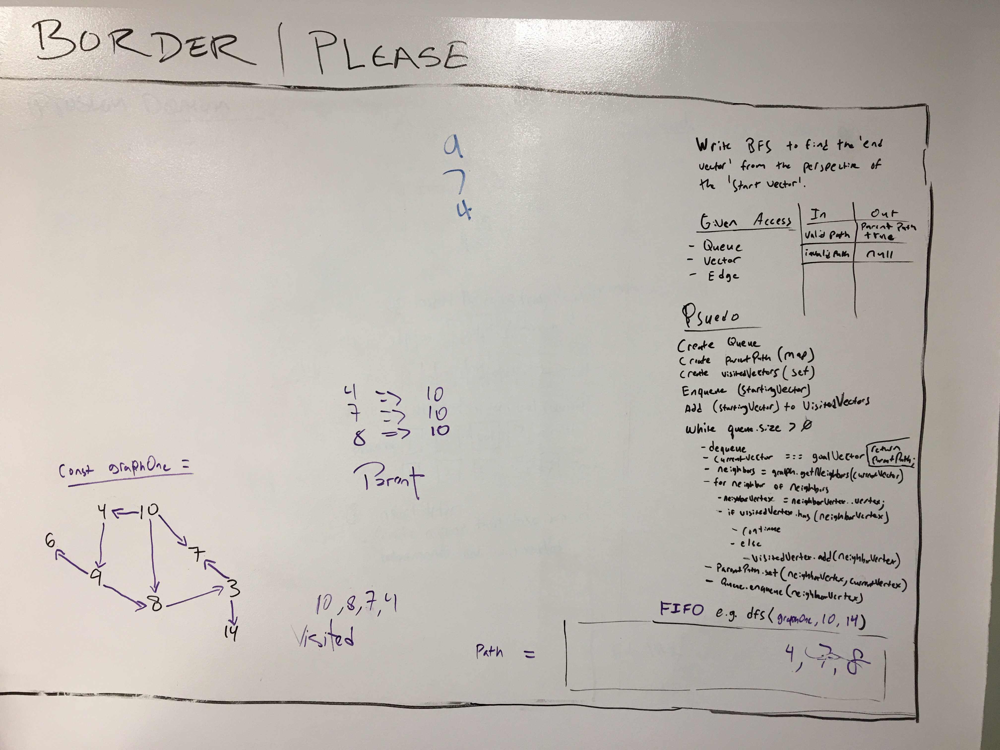

 


# coding-challenge-40 
### BFS (Breadth-first search)

create a breath-first search function to find a vector using a starting point and an end point.

### Solution, Algo & Features

### Running

Examples

[x] create a graph and test the BFS
```
const testGraph = BFS.graphs.graphOne;
const ten = BFS.nodes.ten;
const fifteen = BFS.nodes.fifteen;
const path = BFS.functions.bfs(testGraph, ten, fifteen); // null
```

[x] 
```

```

### Tests Performed with Jest
- test that 'INVALID path' returns NULL
- test that 'VALID path' returns TRUE

### Installing

To use this in your code:

- git clone repo 
- npm install 
- require('../src/lib/bfs');

## Built With

* Node
* Eslint
* jest

## Contributing

Please feel free to contribute. Master branch auto merge locked for approval.

## Versioning

*n/a*

## Authors

 **Benjamin West** 

## License

*none*
