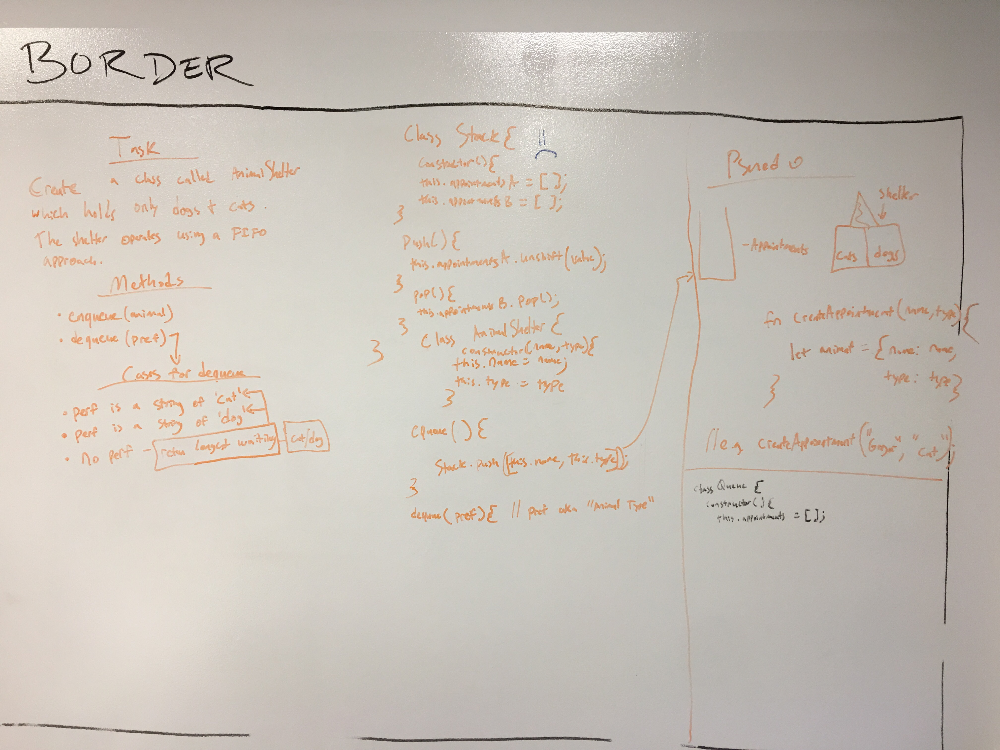

 

[

# coding-challenge-12
###fifo_animal_shelter

Create a class called AnimalShelter which holds only dogs + cats. The shelter operates using a FIFO approach.

### Solution, Algo & Features

* equeue(animal) 
* dequeue(perf)  -- return the longest waiting of it's type

** perf is a string of \'cat\' 

** perf is a string of \'dog\' 

* no perf -- return longest waiting either \'cat\' or \'dog\'

### Running

Examples

[x] enqueue();
```
AnimalShelter = new Queue();
AnimalShelter.enqueue({ type: 'cat', name: 'betsy', placeInLine: AnimalShelter.appointmentNumber });
AnimalShelter.enqueue({ type: 'cat', name: 'tom', placeInLine: AnimalShelter.appointmentNumber });
AnimalShelter.enqueue({ type: 'dog', name: 'cindy', placeInLine: AnimalShelter.appointmentNumber });
AnimalShelter.enqueue({ type: 'dog', name: 'alex', placeInLine: AnimalShelter.appointmentNumber });
AnimalShelter.enqueue({ type: 'cat', name: 'paul', placeInLine: AnimalShelter.appointmentNumber });
AnimalShelter.enqueue({ type: 'dog', name: 'frank', placeInLine: AnimalShelter.appointmentNumber });

```

[x] dequeue(perf); // can be 'dog' or 'cat' for perf
```
AnimalShelter.dequeue('dog');

```

[x] dequeue(); // no perf
```
AnimalShelter.dequeue();

```

### Tests Performed with Jest
- dequeue should be "animal agnostic" and simply FIFO - betsy is removed
- Test dequeue with passing a perf = "cat" to show FIFO will be "dog driven" - frank is removed
- Re-uses last tests data but performs a dequeue without a perf to show carl still exists - betsy is removed (different data set as test 1)
- dequeue with perf as dog - cindy is removed

### Installing

To use this in your code:

- git clone repo 
- npm install 
- require('../src/lib/fifo_animal_shelter');

## Built With

* Node
* Eslint
* jest

## Contributing

Please feel free to contribute. Master branch auto merge locked for approval.

## Versioning

*n/a*

## Authors

 **Benjamin West** 

## License

*none*
