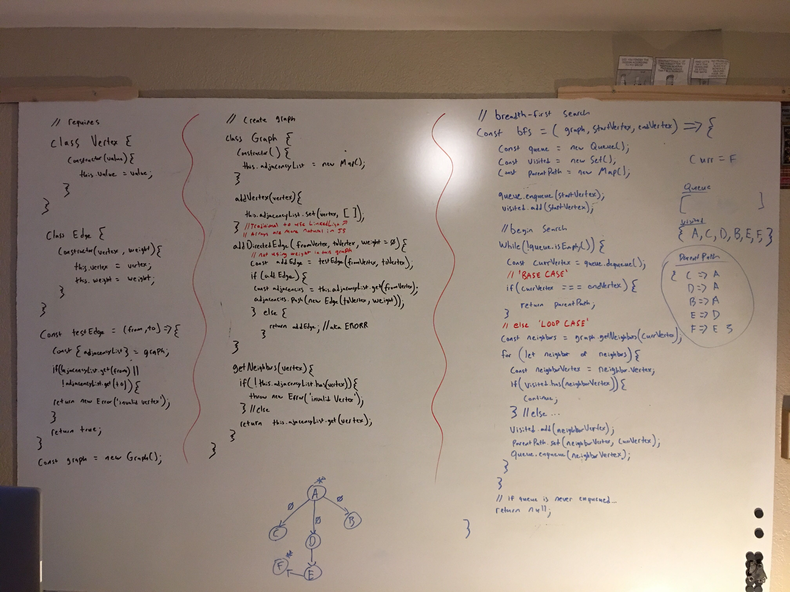

## Code Challenge ACF4: graphs

Contains but not limited to various problems, search methods, or techniques, about or using graphs

# Whiteboard

### BFS

### Jest Tests

###### bfs.js

- retraces parentPath mapping and confirms retrace is valid

###### next-thing.js

- *coming soon*

#### Installing

To use this in your code:

- git clone repo 
- npm install 

### Built With

* Node
* Eslint
* jest

### Author

Benjamin West
