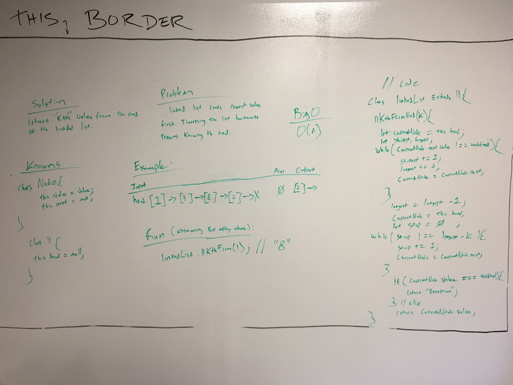

 coding-challenge-07: ll_kth_from_end
===
[](https://travis-ci.com/bgwest/coding-challenges)

### Summary

* .llKthFromEnd - return the kth value from the end of a linked list

### Running

Example:
```
let newLinkedList = new LinkedList();
newLinkedList.append(10);
newLinkedList.append(2);
newLinkedList.append(8);

newLinkedList.prependReplace(1);
```

### Tests Performed with Jest
- creating a new node with Node class. Expecting an object.
- Instantiate new linkedList class. Expecting an object.
- Create a new linked list and append a value. Should equal 10.

### Installing

To use this in your code:

- git clone repo 
- npm install 
- require('../src/lib/ll_kth_from_end');

## Built With

* Node
* Eslint
* jest

## Contributing

Please feel free to contribute. Master branch auto merge locked for approval.

## Versioning

*n/a*

## Authors

 **Benjamin West** 

## License

*none*
