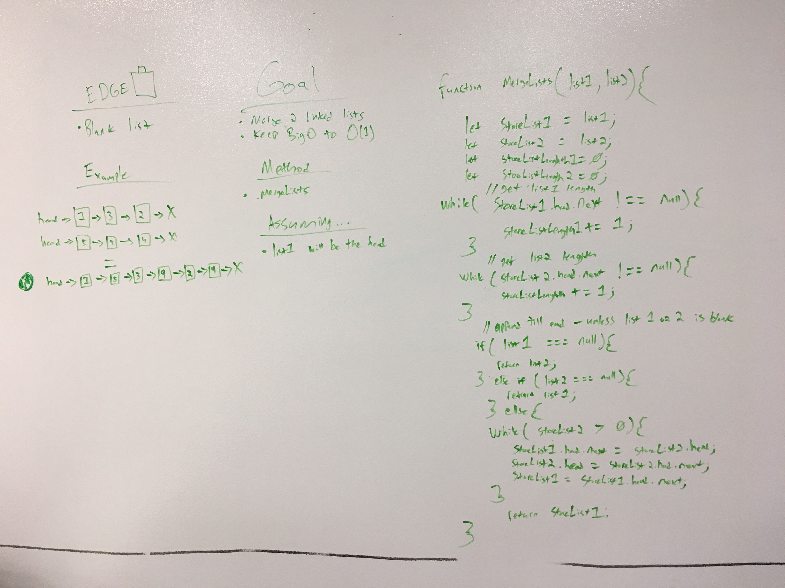

 coding-challenge-08: ll_merge
===
[](https://travis-ci.com/bgwest/coding-challenges)

### Goals

* .ll_merge - merge 2 link lists together with list1 (listA) as the head
* Keep BigO to O(1)

### Running

Example:
```
const listA = new linkedLists.make();
const listB = new linkedLists.make
listA.autoAppend(10, 'A');
listB.autoAppend(5, 'B');
const test = new linkedLists.find();
const mergedList = test.mergeLists(listA, listB);
// expected list: head -> 27, 8, 24, 6, 21, 4, 18, 2, 15, 0, 12, 9, 6, 3, 0 -> null
```

### Tests Performed with Jest
- creating a new node with Node class. Expecting an object.
- Instantiate new linkedList class. Expecting an object.
- Test program returns 27 head of the newly merged list.
- Test program .next x 6 returns 4.

### Installing

To use this in your code:

- git clone repo 
- npm install 
- require('../src/lib/ll_merge');

## Built With

* Node
* Eslint
* jest

## Contributing

Please feel free to contribute. Master branch auto merge locked for approval.

## Versioning

*n/a*

## Authors

 **Benjamin West** 

## License

*none*
