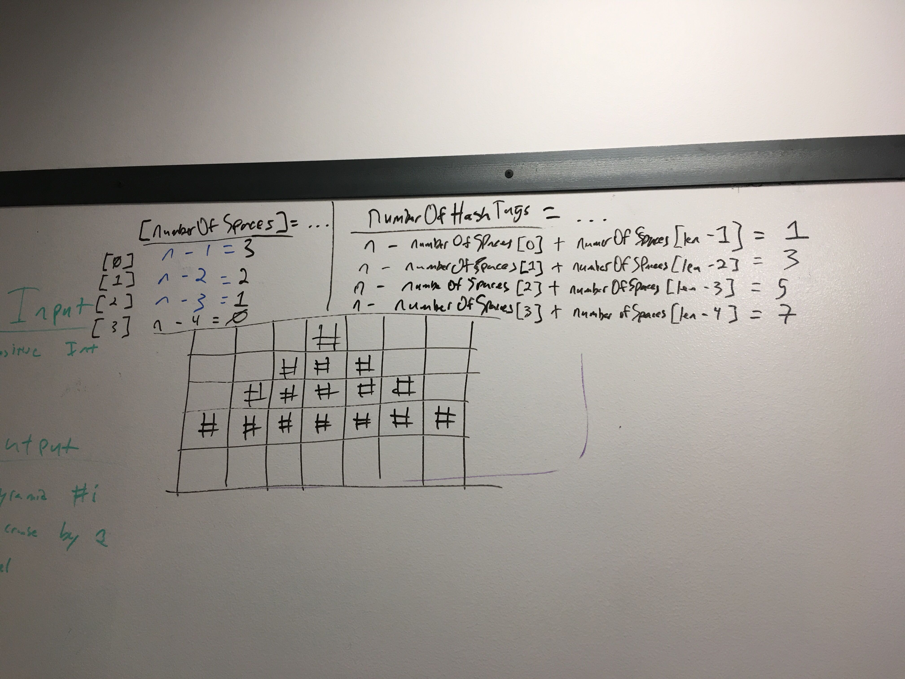

## Code Challenge ACF3: matrices

Various problems about or using matrices

# Whiteboard

### pyramid algo

### Jest Tests

###### pyramid.js

- *coming soon*

###### spiral.js

- *coming soon*

#### Installing

To use this in your code:

- git clone repo 
- npm install 

### Built With

* Node
* Eslint
* jest

### Author

Benjamin West
