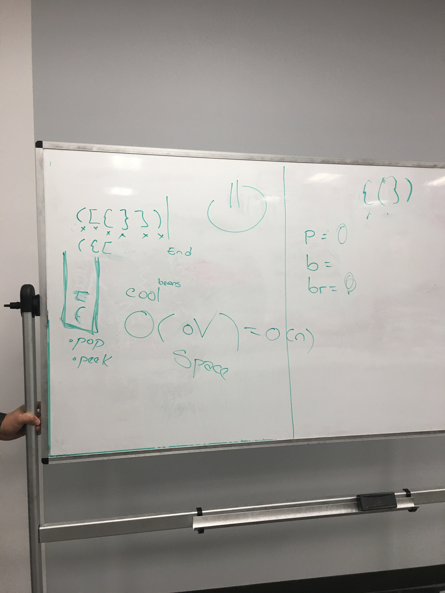
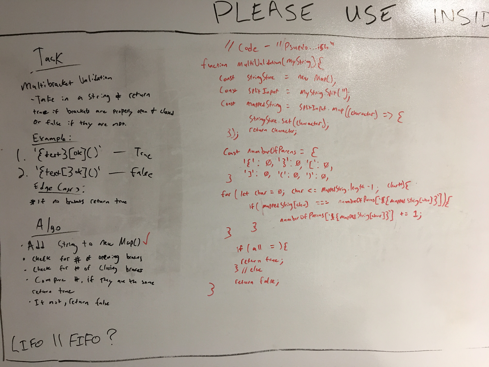

# coding-challenge-31: multi-bracket_validation
## Visual Algos
#### correct
 
#### incorrect
 

[](https://travis-ci.com/bgwest/coding-challenges)

## Problem

A function that takes a string as its only argument, and should return a boolean representing whether or not the 'brackets' in the string are balanced. 

There are 3 types of 'brackets':
```
Parentheses : ()
Square Brackets : []
Curly Braces : {}
```

### Example Patterns & Expected Return

```
{} 	                    TRUE
{}(){} 	                    TRUE
()[[Extra Characters]] 	    TRUE
(){}[[]] 	            TRUE
{}{Code}[Fellows](()) 	    TRUE

[({}] 	                    FALSE
(]( 	                    FALSE
{(}) 	                    FALSE
```

### Stack methods 
```
// Stack methods:
  //   - .push - pushes (value) onto stack
  //   - .pop - pops (value) off the stack
  //   - .peek - peek at top value without 'the pop'
```

### Running

Examples

[x] buildStack();
```
const testBuild = multiBracketValidation.functions.buildStack(multiBracketValidation.testStrings.validStrings['2']);
```

[x] validateStack();
```
const testValidate = multiBracketValidation.functions.validateBuild(testBuild);
console.log(testValidate); // true
```

### Tests Performed with Jest
- test that a string with valid bracket syntax, should return true
- need to add
- need to add

### Installing

To use this in your code:

- git clone repo 
- npm install 
- require('../src/lib/multi-bracket_validation');

## Built With

* Node
* Eslint
* jest

## Authors

 **Benjamin West** 
