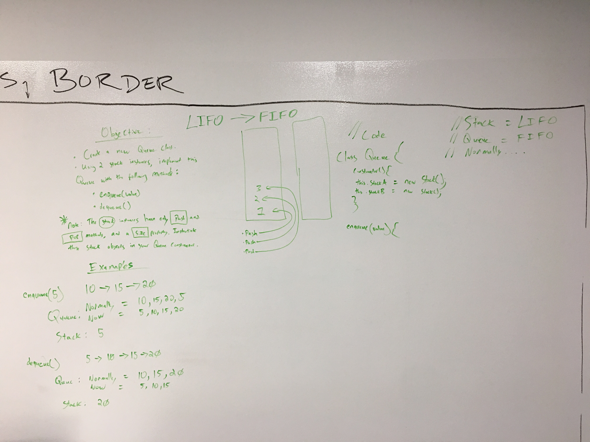
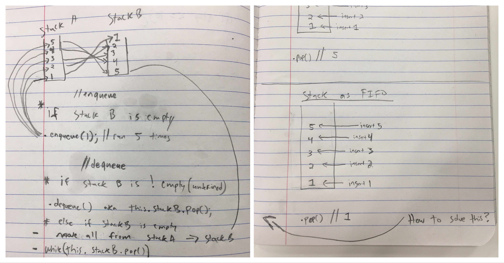

#coding-challenge-11: queue_with_stacks

##Whiteboard setup
 
##Solution notes


coding-challenge-11: queue_with_stacks
===

[](https://travis-ci.com/bgwest/coding-challenges)

## Problem

Queues normally behave FIFO (e.g. arr.unshift / arr.pop) and stacks as LIFO (e.g. arr.unshift / arr.shift). As a result, trying to use a stack like a queue will not compute. However, if we look at the problem in a different way we can mimic this behavior for the sake of demonstration and exercise.

### Algo & Features

To do this efficiently, we will need 2 stacks. enqueue(value) will be pushed (unshifted) into stackA. Upon dequeue(), stackA will spill over into stackB for LIFO to FIFO re-arrangement. dequeue() will then pop values off of stackB in FIFO arrangement.

* enqueue(value) - pushes (inserts) a value into the queue 
* dequeue() - first run will spill over values from stackA to stackB in FIFO arrangement. each run this, until stackB is empty, will pop a value
* clearQueue() - additional function that can be used to clear the remaining queue items in stackB

### Running

Examples

[x] enqueue();
```
myQueue.enqueue(1);
myQueue.enqueue(2);
myQueue.enqueue(3);
myQueue.enqueue(4);
myQueue.enqueue(5);

console.log(myQueue); // Queue { stackA: Stack { stack: [ 5, 4, 3, 2, 1 ] }, stackB: Stack { stack: [] } }

```

[x] dequeue();
```
myQueue.dequeue();

console.log(myQueue); // Queue { stackA: Stack { stack: [] }, stackB: Stack { stack: [ 2, 3, 4, 5 ] } }

```

[x] clearQueue();
```
myQueue.clearQueue();

console.log(myQueue); // Queue { stackA: Stack { stack: [] }, stackB: Stack { stack: [] } }

```

### Tests Performed with Jest
- perform an enqueue 5x should leave the 2nd value, postion [1], as 4.
- perform a dequeue once move stackA (LIFO) to stackB (FIFO) and pop first value.
- perform enqueue, dequeue, and clearQueue to check for return of 0 length

### Installing

To use this in your code:

- git clone repo 
- npm install 
- require('../src/lib/queue-with-stacks');

## Built With

* Node
* Eslint
* jest

## Contributing

Please feel free to contribute. Master branch auto merge locked for approval.

## Versioning

*n/a*

## Authors

 **Benjamin West** 

## License

*none*
