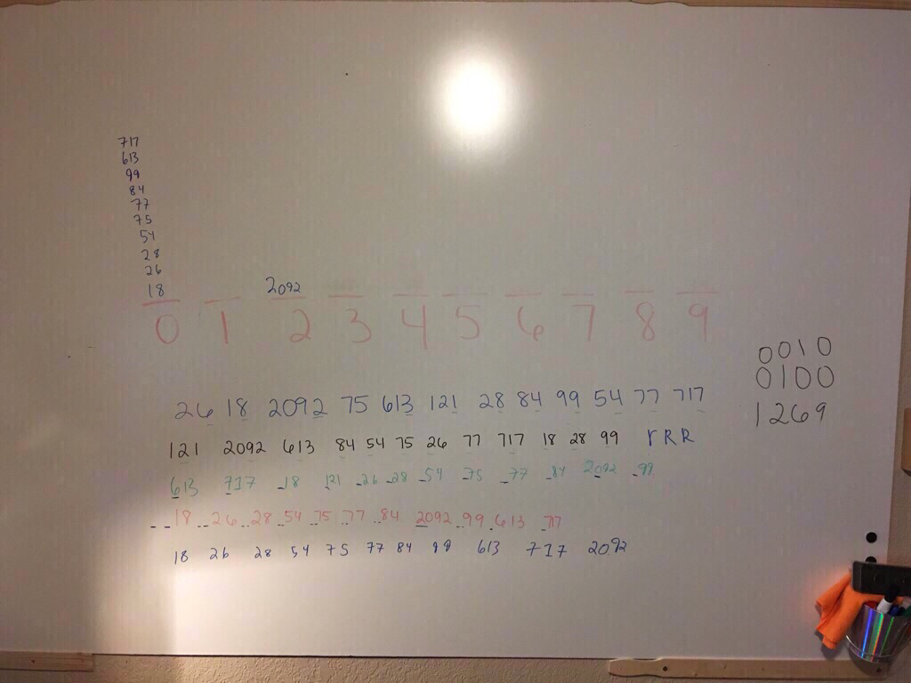

# Sorting Algorithms Challenge 
### Visual Algo
#### Radix Sort
 


A burt force way to sort numbers. This code is terribly inefficient and as the input (array) grows, the time and space complexity grow exponentially.

### Running

Examples

[x] 1
```
    const sorts = require('../radix_sort');
    const testArray = sorts.arrays.testArrayOne;
    sorts.queues.testQueueOne = resetContainer;
    const testQueue = sorts.queues.testQueueOne;
    const highestValue = sorts.functions.findLongestIndex(testArray);
    const allSorted = sorts.functions.radixSort(testQueue, testArray, highestValue);
    const expectedSort = ['0', '5', '20', '54', '77', '901', '1000'];
```

### Tests Performed with Jest
- manually reversed testArrayTWO and testing radixSort is returning the same value
- manually reversed testArrayONE and testing radixSort is returning the same value

### Installing

To use this in your code:

- git clone repo 
- npm install 
- require('../src/lib/sorts.js');

## Built With

* Node
* Eslint
* jest

## Authors

 **Benjamin West** 
