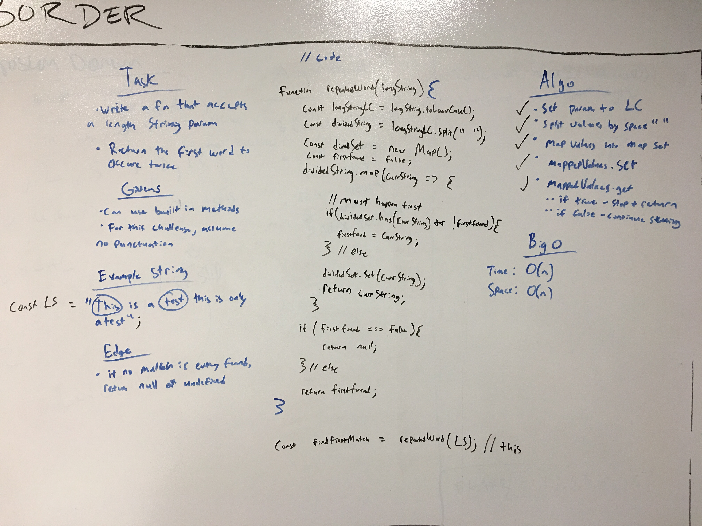

 


## coding-challenge-27: repeated_word

#### Objective
Write a fn that accepts a length string param and returns the first word to occur twice.

##### Limitations and knowns
* can use built in methods if desired
* for this challenge, assume no punctuation

##### Edge Case(s):
* if no match is ever found, return null or undefined 

##### BigO
- Space: O(H)
- Time: O(n)

### Running code

Examples

[x] run where the first dup is found
```
const longstring = 'This is a test this is only a test';
const testRun = repeatedWord.run(longstring);
console.log(testRun); // this
```

[x] run where no dups are found (null)
```
const longstring = 'This sentence is void of any repeated words so it should return null';
const testRun = repeatedWord.run(longstring);
console.log(testRun); // null
```

*NOTE: uncomment out debugging section in code to run tests as well.*

### Tests Performed with Jest
- test0: test should return "null"
- test1: test should return "we"
- test2: test should return "no"
- test3: test should return "tragedy"

### Installing

To use this in your code:

- git clone repo 
- npm install 
- require('../src/lib/repeated_word');

## Built With

* Node
* Eslint
* jest

## Contributing

Please feel free to contribute. Master branch auto merge locked for approval.

## Version

*n/a*

## Authors

 **Benjamin West** 
