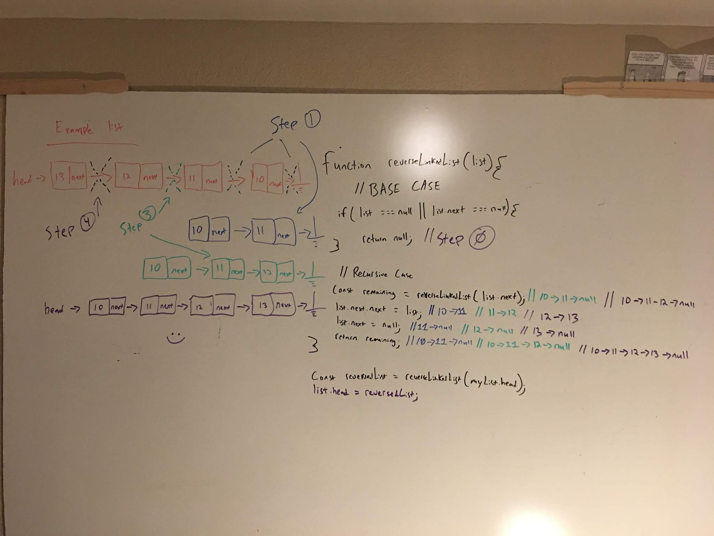
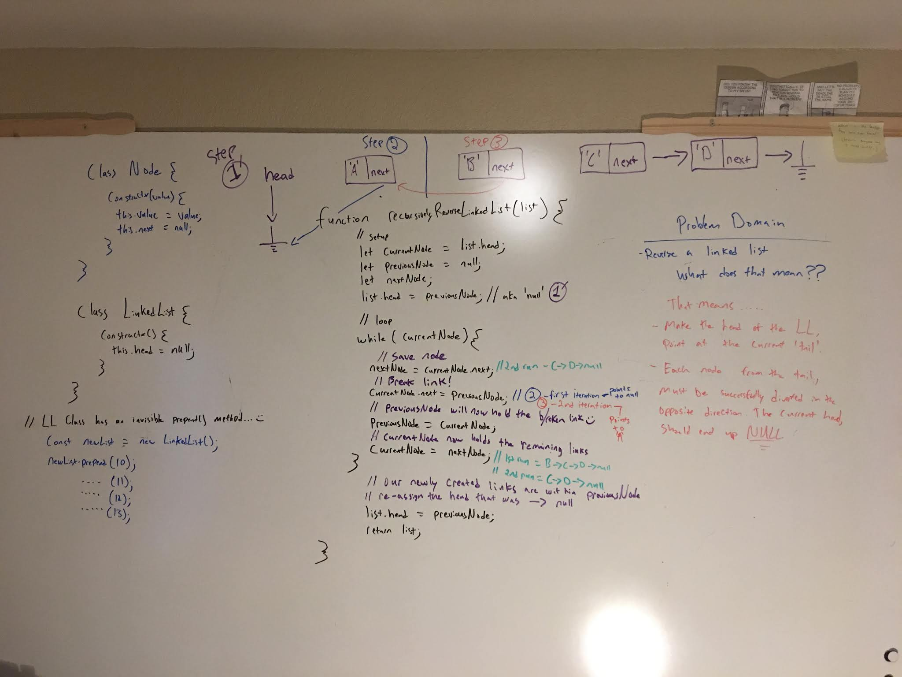

## Code Challenge ACF1: reversals

Ways to reverse data sequences with various data-structures and algorithms.

# Whiteboard of code

### recursive linked list reversal 

### iterative reversal of linked list 

 

### reversal of linked list with a stack

 

### Jest Tests

- testing if reverse values of a reverse-linked-list-with-stack.js are as expected

- adding more tests soon

#### Installing

To use this in your code:

- git clone repo 
- npm install 

### Built With

* Node
* Eslint
* jest

### Author

**Benjamin West** 
