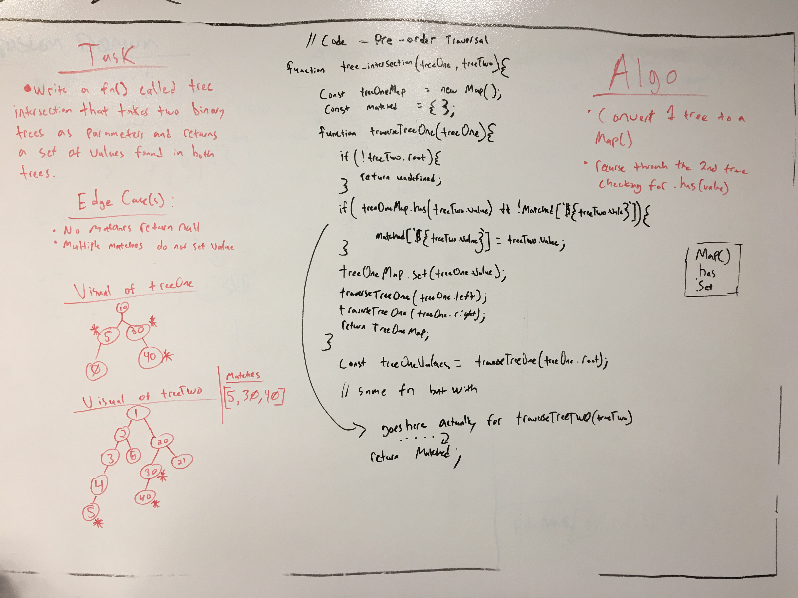

 

[

## Code Challenge 28: tree_intersection

##### Objective
write a fn() called tree_intersection that takes two binary trees as parameters and returns a set of values found in both trees.

##### Edge Cases
* No matches return null
* Multiple matches should not set duplicate values in the returned object/array

##### Limitations
* must solve in O(n^2) or less

##### BigO
- Space: O(N + N + N + H) = O(N)
- Time: O(N)

### Running

Examples

[x] normal run
```
const normalRun = fizzBuzz.runTraversal(tree, 0);
console.log(countTheFizzBuzz);
```

[x] countTheFizz
```
const countTheFizz = fizzBuzz.tests.findFizzBuzz(tree, { type: 'fizz', counter: 0});
console.log(countTheFizz);
```

[x] countTheBuzz
```
const countTheBuzz = fizzBuzz.tests.findFizzBuzz(tree, { type: 'buzz', counter: 0});
console.log(countTheBuzz);
```

[x] countTheFizzBuzz
```
const countTheFizzBuzz = fizzBuzz.tests.findFizzBuzz(tree, { type: 'fizzbuzz', counter: 0});
console.log(countTheFizzBuzz);
```

*NOTE: uncomment out debugging section in code to run tests as well.*

### Tests Performed with Jest
- test for the correct amount of fizzes
- test for the correct amount of buzzes
- test for the correct amount of fizzbuzzes

### Installing

To use this in your code:

- git clone repo 
- npm install 
- require('../src/lib/fizz_buzz_tree');

## Built With

* Node
* Eslint
* jest

## Authors

 **Benjamin West** 
